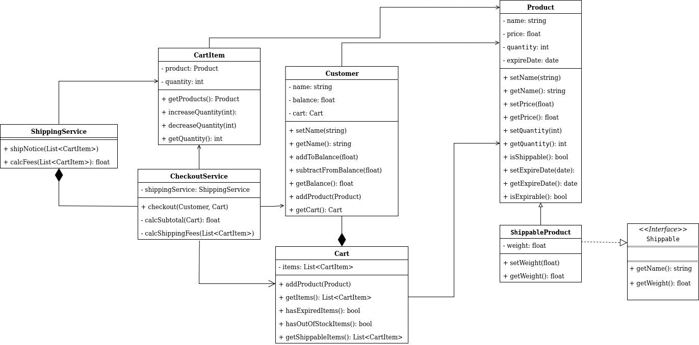

# e-commerce system

## Project Structure
```
  src/
  ├── interfaces/
  │ └── Shippable.java
  ├── model/
  │ ├── Cart.java
  │ ├── CartItem.java
  │ ├── Customer.java
  │ ├── Product.java
  │ └── ShippableProduct.java
  ├── service/
  │ ├── CheckoutService.java
  │ └── ShippingService.java
  ├── AppTestCases.java
  ├── Main.java
  └── README.md
```

## UML Diagram

